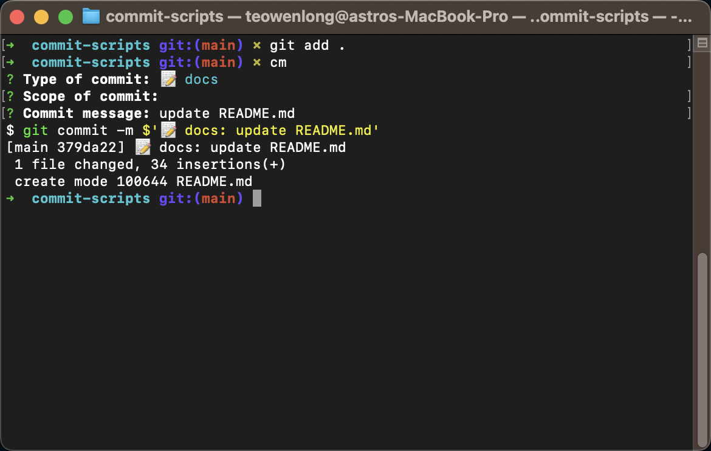
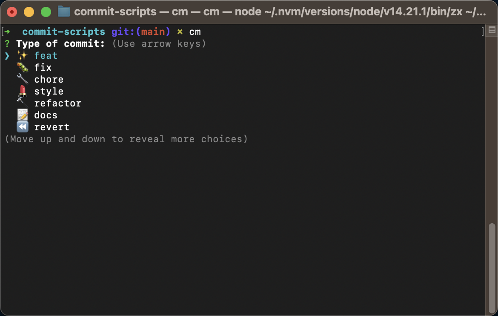

# CM script

CLI script for linting your commit message 🎉



## Packages

- zx: https://github.com/google/zx
- inquirer: https://github.com/SBoudrias/Inquirer.js

## Usage

Clone the repo

```bash
git clone git@github.com:WenLonG12345/commit-script.git
```

Open the repo and install packages

```bash
npm i
npm i zx -g
```

Test to run the script

```bash
zx commit.js
```

Then add the command to your environment variables.

- If you are using macOS (zsh), you can add the code below to `zshrc` :

```bash
## open zshrc
code ~/.zshrc

## add this function to zshrc
cm () {  ## cm can be renamed to any name you want
  zx /Users/teowenlong/commit-scripts/commit.js  ## path to commit.js
}
```

- If you are using Powershell, please refer to [zx-script](https://github.com/Hacker-C/zx-scripts/tree/main)

## Final Result


## Reference
All the credit goes to [zx-scripts](https://github.com/Hacker-C/zx-scripts/tree/main). Since the author only showcase for Powershell, hence I clone the repo and make it suitable for my usecase, and showcase for MacOS usage.
